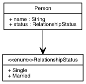

# umlaut

A Clojure tool that receives a umlaut schema and outputs code.

## Schema language

`umlaut` tool expects to receive a `umlaut` schema. A `umlaut` schema is general-purpose schema definition language that has been designed to provide support for generating models in several different languages in a flexible way.

Let's go over `umlaut`'s syntax and characteristics.

## General

The primitive types are: `["String" "Float" "Integer" "Boolean" "DateTime", "ID"]`. If an attribute has a type that is not primitive, it must be properly declared.

By default, all declared attributes are *non-null*. Nullable attributes must have the symbol `?` after the attribute type.

Umlaut receives a folder as input. It will search for all files with extension `umlaut` and load the schema into memory. One attribute definition can use the types defined in any other `umlaut` file under the same folder. No need for includes!

Identifiers are valid if they are valid in this regex: `[_A-Za-z][_0-9A-Za-z]*`.

Comments are indicated by `//`.

### Attributes and methods
Inside of types and interfaces, you can declare attributes and methods.

#### Attributes
Attributes must always have a type (primitive or not), and are declared like this: `identifier: type`. You can add arity after the type to indicate a collection of items of that same type, like this: `identifier: type[min..max]`. Examples:
```
  firstName: String
  middleName: String?
  lastName: String  // This is a comment
  dob: DateTime
  age: Float
  friends: String[0..n]
```

#### Methods
We call methods or parametrized attributes the attributes that can receive parameters, perform some computation and return an arbitrary type. The have the following form: `identifier(identifier: type, ..., identifier: type): type`.

There is no limit in the number of parameters a method can receive. You can use the optional modifier `?` after any one of the types to indicate optionality. The return type of the method must always be specified. Examples:
```
  getFirstName(): String
  setFirstName(name: String): String
  computeAge(dateOfBirth: DateTime, today: DateTime): Integer
```

### type
```
type Person {
  id: ID
  name: String
  friends: String[0..n]
  isEmployed: Boolean
  email: String?
}
```

- `friends` is an example of a collection.
- `email` is a nullable attribute.
- All attributes are primitive in this example.


### interface
You can also declare an `interface`, usually to create composition of models.

```
interface Person {
  id: ID
  name: String
  email: String?
}

interface Human {
  temperature: Float
}

type Employee : Person Human {
  salary: Float
  changeSalary(newSalary: Float): Float
}
```

- `umlaut` supports single/multiple inheritance, in this example `Employee` inherits from `Person` and `Human`. So `Employee` will have all the fields of its parent types, plus its own.


### enum

You can create enums like this:
```
enum RelationshipStatus {
  Single
  Married
}

type Person {
  name: String
  status: RelationshipStatus
}
```

### Annotations
Annotations above the type declaration are used by a some code generators.
Annotations have this form: `@<space> key [value]`.
You can add several values for a given key, only if the generator documentation allows that.
```
@lang/lacinia identifier query
type QueryRoot {
  getFriends(): Person[0..n]
}
```
See Lacinia documentation for more information.

# Generators

## Diagram

We use dot language to create diagram images. In order to build a diagram, you need to use the `diagram` keyword in the umlaut file.

```
enum RelationshipStatus {
  Single
  Married
}

type Person {
  name: String
  status: RelationshipStatus
}

diagram filename {
  (Person)!
}
```

The above example generates this diagram:



- A file named `all.png` is always created with all the types defined in the umlaut document.
- The file created is `filename.png` because of the identifier in the `diagram` keyword.
- The diagram includes the `RelationshipStatus` box because of the `!` used in the `(Person)` group. This tells umlaut to recursively draw all boxes that compose `Person`. If the `!` was omitted, the diagram would have a single `Person` box.
- You can have as many diagrams definitions/combinations as you want, just give them different names.
- You can not have types/enums/interfaces with the same names of reserved words of dot language: (node, edge, graph, digraph, subgraph, and strict).


## Lacinia

Lacinia is a graphQL library for schemas. It's an [EDN](https://github.com/edn-format/edn) file with all the types, queries, inputs, mutations, and enums.

```
enum RelationshipStatus {
  Single
  Married
}

@lang/lacinia resolver salary resolve-salary
type Person {
  name: String?
  status: RelationshipStatus
  salary: Float
}

@lang/lacinia identifier query
type QueryRoot {
  getFriends(): Person[0..n]
}
```

Will generate:
```
{:objects
 {:Person
  {:fields
   {:name {:type String},
    :status {:type (non-null :RelationshipStatus)},
    :salary {:type (non-null Float), :resolver :resolve-salary}},
   :implements []},
  :Profession
  {:fields {:name {:type (non-null String)}}, :implements []}},
 :enums {:RelationshipStatus {:values ["Single" "Married"]}},
 :interfaces {},
 :queries
 {:getFriends {:type (non-null (list (non-null :Person))), :args {}}}}

```

#### Lacinia annotations

Lacinia generator heavily uses annotations. In the above example, we used `@lang/lacinia identifier query` to indicate that `getFriends` should be placed under the `queries` key.

The following annotations are also valid for the lacinia generator. They should all be placed above the type definition that they are affecting.
```
@lang/lacinia resolver resolve-type  // Default type structure from resolve-type method
@lang/lacinia resolver salary resolve-salary  // Default value for salary in resolve-salary
@lang/lacinia identifier query  // Will place the next type definition under queries key
@lang/lacinia identifier mutation  // Will place the next type definition under mutations key
@lang/lacinia identifier input  // Will place the next type definition under input-objects key
```
